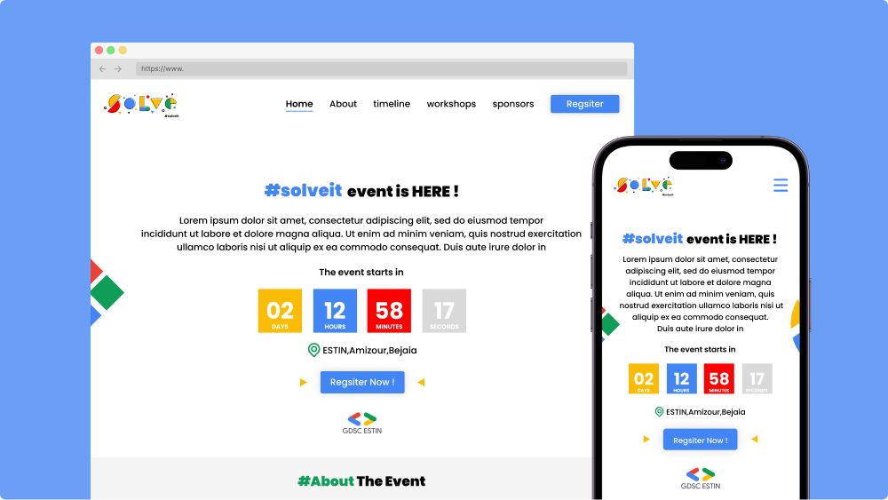

<h1 align="center">Solve-it event website (GDSC Estin)</h1>

A landing page website for the <b>Solve-it</b> event that will be hosted by GDSC Estin club.

## Preview

You can access the website from this link: [Solve-it ↗](https://aymendn.github.io/solve-it-event-website)

## Technologies & Libraries

Project is created with:

* HTML, CSS and JavaScipt
* [Swiper](https://swiperjs.com/) for sliders
* [AOS - Animate On Scroll Library](https://michalsnik.github.io/aos/)